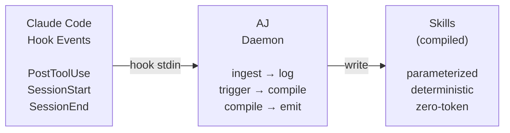
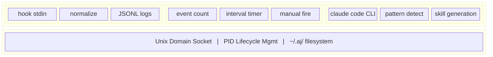

```
                                    __       _ _ __
   ____ _____ ____  ____  ____ _  / /      / (_) /_
  / __ `/ __ `/ _ \/ __ \/ __ `/ / / ___  / / / __/
 / /_/ / /_/ /  __/ / / / /_/ / / / / _ \/ / / /_
 \__,_/\__, /\___/_/ /_/\__/ /_/ /_/\___/_/_/\__/
      /____/         /___/  /_/

      the daemon that compiles your workflows into existence
```

> *"We are what we repeatedly do. Excellence, then, is not an act, but a habit."*
> — **Aristotle**, *Nicomachean Ethics*
>
> Your AI agent repeats the same multi-step workflows hundreds of times —
> `kubectl logs`, then `grep`, then `edit`, then `apply` — burning tokens
> on what has already become muscle memory. AJ watches these habits
> form, and in quiet moments of reflection, distills them into instinct.
>
> Like an artisan whose hands move before conscious thought arrives,
> the agent simply *knows* what to do next. Ten thousand tokens of
> deliberation become two hundred tokens of certainty. The stochastic
> becomes deterministic. Repetition becomes skill.

---

## What is AJ?

A background JIT compiler for autonomous coding agents. It operates silently via Claude Code hooks, observes recurring tool-use patterns across sessions, and compiles them into zero-token parameterized skills — no manual configuration required.



### The Numbers

| Before | After |
|--------|-------|
| ~10,000 tokens per routine task | ~200 token skill invocation |
| >30s stochastic reasoning | <1s deterministic execution |
| Manual skill authoring | Automatic pattern compilation |

## Installation

```bash
go install github.com/anthropics/agentjit/cmd/agentjit@latest
```

Or build from source:

```bash
git clone https://github.com/anthropics/agentjit.git
cd agentjit
make build
make install
```

## Quick Start

```bash
# Initialize AJ — creates ~/.aj/, installs Claude Code hooks
aj init

# Or install hooks into a specific project only
aj init --local

# Start the background daemon
aj daemon start

# Trigger a compilation manually
aj compile

# Import historical Claude Code transcripts
aj bootstrap --since 2026-03-01

# View generated skills
aj skills list

# Adjust configuration
aj config get --all
aj config set compile.trigger_mode interval
```

## Architecture

AJ is three loosely-coupled layers in a single Go binary:



**Design philosophy:** The Go binary is a dumb pipe. It handles I/O, lifecycle, and configuration. All intelligence lives in the compiler prompt that Claude executes during compile cycles.

### Data Flow

1. **Ingest** — Claude Code hooks fire on every tool use, piping JSON to `aj ingest` via stdin
2. **Normalize** — Events are normalized into a canonical schema and appended to date/session-partitioned JSONL logs
3. **Trigger** — The daemon monitors event counts or timers and fires the compilation sequence
4. **Compile** — Claude Code reads the logs, identifies recurring multi-step patterns, and generates parameterized skills
5. **Emit** — Skills are written to `~/.aj/skills/` and become available immediately

### Filesystem Layout

```
~/.aj/
├── config.json                 # Configuration with sensible defaults
├── daemon.pid                  # Daemon process ID
├── daemon.sock                 # Unix domain socket
├── logs/                       # Date/session-partitioned JSONL
│   └── 2026-04-01/
│       └── session_abc123.jsonl
├── skills/                     # Compiled skills (auto-generated)
├── compile-log.jsonl           # Compiler activity log
└── last_compile_marker         # Timestamp of last compile run
```

## Configuration

Defaults are designed to work out of the box:

```json
{
  "daemon": { "idle_timeout_minutes": 30 },
  "ingestion": { "max_response_bytes": 512, "log_retention_days": 30 },
  "compile": {
    "trigger_mode": "manual",
    "trigger_interval_minutes": 30,
    "trigger_event_threshold": 100,
    "min_pattern_frequency": 3,
    "min_token_savings": 500
  },
  "scope": {
    "global_cli_tools": ["kubectl", "docker", "gh", "aws", "terraform"],
    "cross_project_threshold": 2
  }
}
```

Use dot-notation to get/set any value:

```bash
aj config get compile.trigger_mode
aj config set compile.min_pattern_frequency 5
aj config reset
```

## CLI Reference

| Command | Description |
|---------|-------------|
| `aj init` | Create `~/.aj/`, install hooks, write config |
| `aj init --local` | Install hooks into project-local settings |
| `aj init uninstall` | Remove hooks and optionally delete data |
| `aj daemon start` | Start background daemon |
| `aj daemon stop` | Stop daemon gracefully |
| `aj daemon status` | Show PID, uptime, event count |
| `aj compile` | Manually trigger compilation |
| `aj bootstrap` | Import historical Claude Code transcripts |
| `aj config get [KEY]` | Read config values |
| `aj config set KEY VAL` | Write config values |
| `aj skills list` | List generated skills with ROI stats |
| `aj skills remove NAME` | Remove a compiled skill |
| `aj ingest` | Internal: receive hook JSON from stdin |

## Development

```bash
make build        # Build binary to ./aj
make test         # Run all tests
make clean        # Remove build artifacts
make install      # Install to $GOPATH/bin
```

**Requirements:** Go 1.22+

## How It Works — The Compile Cycle

When the daemon triggers a compile (by event threshold, timer, or manual invocation), it orchestrates a reflection cycle:

1. **Gather** — Collect JSONL logs since the last compile marker
2. **Analyze** — Pass logs to Claude with the compiler prompt
3. **Identify** — Claude detects recurring multi-step tool-use patterns (≥3 occurrences)
4. **Parameterize** — Variable parts (file paths, namespaces, pod names) become parameters
5. **Evaluate** — Calculate token savings; reject patterns below the `min_token_savings` threshold
6. **Compile** — Generate deterministic skill files with metadata and ROI tracking
7. **Register** — Skills become immediately available for future sessions

The agent doesn't learn to do new things. It learns to stop *thinking* about things it already knows how to do.

## License

MIT

---

<p align="center">
<i>"The energy of the mind is the essence of life."</i> — Aristotle
</p>
